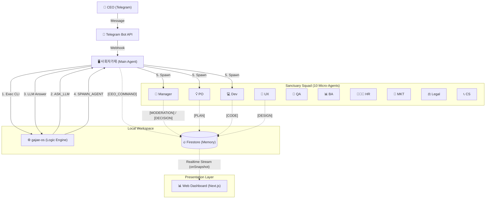

# 🦞 Gajae OS (가재 운영체제)

> **"지능은 고립될 때 노후화되고, 군집할 때 진화한다."**
> 
> 인간 CEO와 **11명의 AI 가재 군단**이 공존하는 **자율형 조직 시스템(Autonomous Org System)**입니다.
> 사회자가재(Main Agent)가 시스템을 오케스트레이션하고, `gajae-os`가 로직을 제어합니다.

---

## 🏗️ Architecture

**Runtime Architecture (v15.3)**


---

## 👥 Sanctuary Squad (가재 군단)

| 코드 ID | 한글 애칭 | 역할 (Role) | 비고 |
| :--- | :--- | :--- | :--- |
| `main` | **사회자가재** | 시스템 호스트 | CEO 명령 수신, CLI 실행, LLM 판단 대행, Spawn 실행 |
| `pm` | **매니저가재** | 공정 관리 | **능동적 사회자(Active Moderator)**, 스케줄링 및 토론 주재 |
| `po` | **기획가재** | 기획 | 요구사항 정의, 기획서 작성 |
| `dev` | **개발가재** | 개발 | 기능 구현, 기술 검토 |
| `qa` | **품질가재** | 품질 | 테스트, 버그 리포트 |
| `ux` | **디자인가재** | 디자인 | UI/UX 설계, 디자인 가이드 |
| `ba` | **분석가재** | 분석 | 비즈니스/데이터 분석 |
| `hr` | **인사가재** | 인사 | 리소스/문화 관리 |
| `mkt` | **마케팅가재** | 마케팅 | 카피라이팅, 홍보 전략 |
| `legal` | **변호사가재** | 법무 | 라이선스/법적 검토 |
| `cs` | **민원가재** | 고객지원 | VOC 분석, 응대 매뉴얼 |

---

## 🚦 Kinetic 13 Protocol (13단계 공정)

모든 작업(Task)은 아래 13단계 공정을 엄격하게 따릅니다. 각 단계 전환 시 **CEO의 승인(`Approval Gate`)**이 필수입니다.

1.  **INBOX:** 명령 수신 및 대기.
2.  **BACKLOG:** 기획가재(PO)의 분류.
3.  **PF (Planning First):** 기획 착수 및 초안 보고.
4.  **FBS (Feasibility Study):** 기술 검토.
5.  **RFD (Request for Design):** 디자인 요청.
6.  **FBD (Finalize by Design):** 디자인 완료.
7.  **RFE_RFK (Request for Eng Kickoff):** 개발 착수 승인 (Gate).
8.  **FUE (Feature Under Eng):** 실제 개발 구현.
9.  **RFQ (Request for QA):** QA 요청.
10. **FUQ (Feature Under QA):** 테스트 진행.
11. **RFT (Request for Test):** 배포 승인 (Gate).
12. **FUT (Feature Under Test):** 스테이징 배포.
13. **FL (Feature Launch):** 라이브 출시.

---

## 📚 Core Documents

*   **[🏛️ 시스템 설계도 (Constitution)](docs/core/process/SYSTEM_DESIGN_V1_0.md)**: 전체 시스템의 상세 기술 명세.
*   **[💖 가재 문화 (Culture)](docs/core/CULTURE.md)**: 가재 컴퍼니의 15대 리더십 원칙.
*   **[🎨 디자인 시스템 (Sanctuary DS)](docs/business/common/design/SANCTUARY_DS.md)**: UI 디자인 가이드라인.

---

## 🚀 Getting Started

1.  **gajae-os 실행 (로컬 엔진):**
    ```bash
    cd gajae-os
    npm install
    npm start
    ```
2.  **사회자가재 호출 (텔레그램/터미널):**
    *   "로그인 기능 만들어줘" 라고 명령하면 시스템이 가동됩니다.

---
*Powered by OpenClaw & LangGraph.js*
