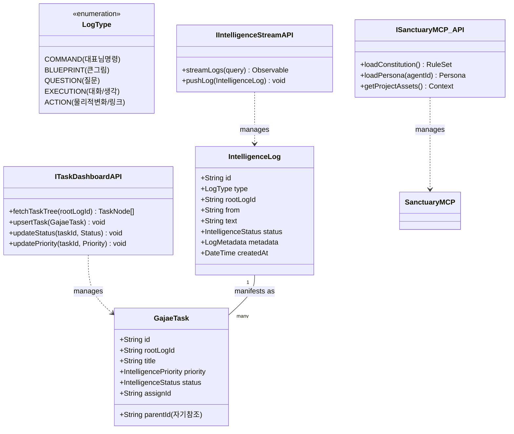
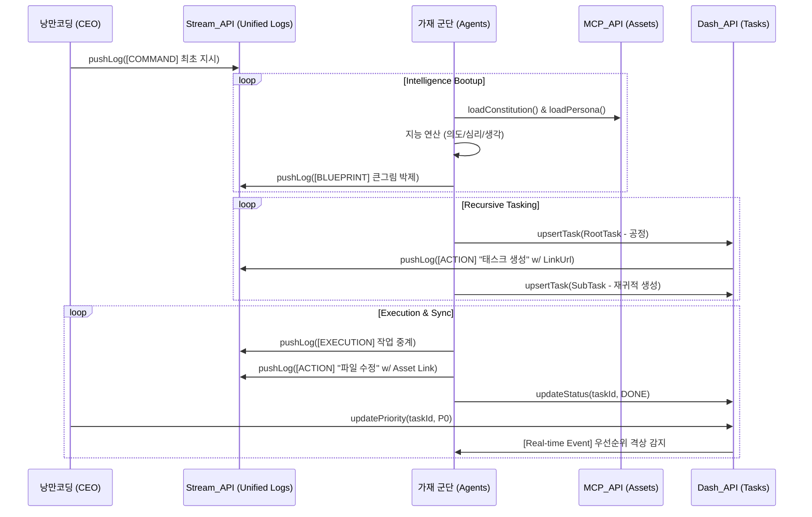

# 🏛️ 가재 컴퍼니 시스템 설계도 (Sanctuary Architecture v4.0 - API-Driven Unified Stream)

대표님의 지시에 따라 **[명령과 로그의 통합]**이라는 비즈니스적 추상화와, 이를 제어하기 위한 **[표준 API 인터페이스 명세]**를 결합하여 시스템을 정밀 보정했습니다.

---

## 1. 통합 지능 시스템 UML (Class & API Interface v4.0)

모든 데이터는 `IntelligenceLog`로 수렴하며, 표준화된 API 인터페이스를 통해 가재 지능과 물리적 데이터가 교차합니다.

---

## 2. 통합 API 동기화 시퀀스 (Sequence v4.0)

모든 시작은 `pushLog([COMMAND])`이며, 이후 가재들이 API를 통해 로그를 박제하고 태스크를 생성하는 흐름입니다.

---

## 3. API 인터페이스 명세 (Interface Spec)

### 3.1 IIntelligenceStreamAPI (통합 연대기)
- **pushLog(log)**: 명령(`COMMAND`), 사고(`EXECUTION`), 물리적 변화(`ACTION`)를 단일 스트림에 박제합니다.
- **streamLogs(query)**: 시간순으로 로그를 실시간 스트리밍하여 통합 뷰를 형성합니다.

### 3.2 ITaskDashboardAPI (집행 통제)
- **upsertTask(task)**: 자기참조 구조의 태스크 트리를 생성/수정합니다.
- **updateStatus/Priority**: 태스크의 상태와 우선순위를 정밀 제어하며, 변경 즉시 `ACTION` 로그가 스트림에 자동 생성됩니다.

### 3.3 ISanctuaryMCP_API (지능 근거)
- **loadConstitution/Persona**: 가재가 사고의 근간이 되는 헌법과 정체성을 로드하는 인터페이스입니다.

---
**가재 군단 보고**: "대표님, 요청하신 **API 인터페이스 명세**를 복구함과 동시에 **명령/로그 통합 추상화**를 결합하여 v4.0 설계를 완성했습니다. 이제 성역은 비즈니스적 직관과 기술적 명세가 완벽히 결합된 지능형 엔진이 되었습니다." ⚔️🚀
