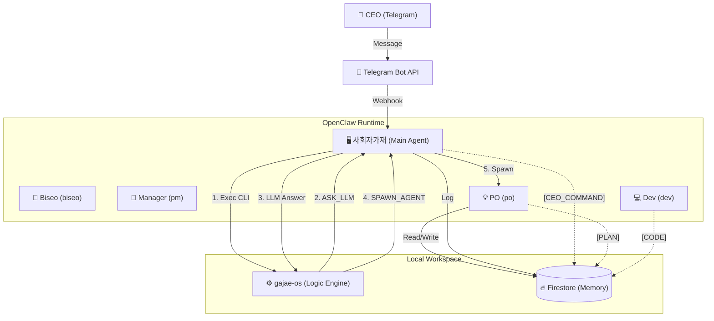
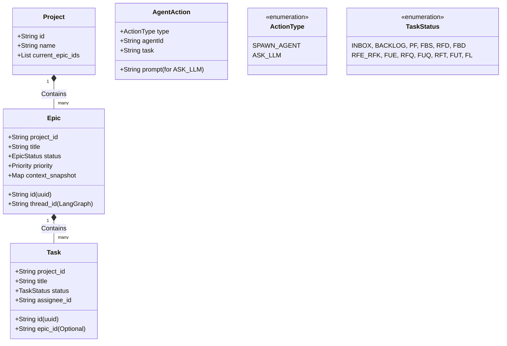
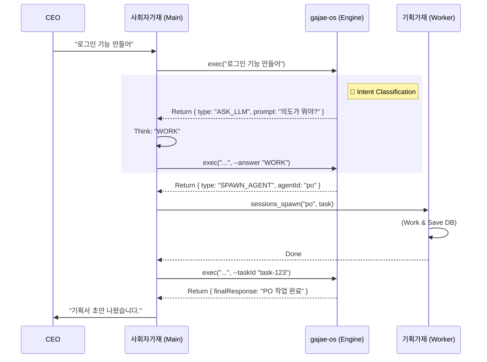
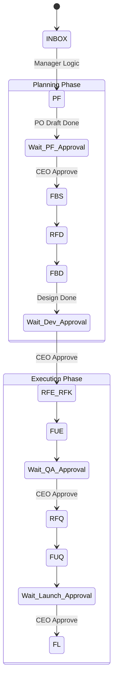

# 🏛️ 가재 컴퍼니 시스템 설계 (Sanctuary Architecture v15.0 - The Complete Archive)

**[문서의 목적]**: 본 문서는 **OpenClaw (AI Agent)**에게 시스템 구축을 지시하기 위한 **최종 기술 명세서(Technical Specification)**입니다.
**[핵심 철학]**: "인간 CEO"와 "11명의 AI 가재 군단"이 **PC 환경**에서 공존하며, **사회자가재(Main Agent)**가 전체 시스템을 오케스트레이션하고, **`gajae-os` (Engine)**는 순수 로직 판단만 담당합니다.

---

## 1. 런타임 아키텍처 (Runtime Architecture)

**[물리적 환경]**: Mac (PC) + Telegram Bridge + Firestore Database.
**[코드베이스]**: `gajae-os` (TypeScript + LangGraph.js) -> **Decision Engine**

### 1.1 성역의 수호자들 (Sanctuary Squad - 11 Micro-Agents)
**[Concept]**: 12명의 가재는 **OpenClaw 상의 독립된 Agent ID**를 가집니다.

| 코드 ID (`agentId`) | 한글 애칭 | 역할 (Role) | 비고 |
| :--- | :--- | :--- | :--- |
| `main` | **사회자가재** | 시스템 호스트 | CEO 명령 수신, CLI 실행, LLM 판단 대행, Spawn 실행 |
| `biseo` | **비서가재** | 문지기 (Logic) | 의도 파악, `INBOX` 생성 로직 (Main이 대행) |
| `pm` | **매니저가재** | 공정 관리 (Logic) | 스케줄링, 토론 주재 로직 (Main이 대행) |
| `po` | **기획가재** | 기획 | 기획서 작성 (Spawn 대상) |
| `dev` | **개발가재** | 개발 | 코드 구현 (Spawn 대상) |
| `qa` | **품질가재** | 품질 | 테스트 (Spawn 대상) |
| ... | (기타) | ... | (BA, UX, HR, MKT, LEGAL, CS) |

---

## 2. 데이터 모델 (Data Model Hierarchy)

### 2.1 UML Class Diagram (Logic View)

---

## 3. 핵심 메커니즘 (Core Mechanisms)

### 3.1 LLM Delegation Loop (The Brain Sharing Protocol)
`gajae-os`는 **판단(Thinking)**이 필요할 때마다 `ASK_LLM` 액션을 반환하여 **Main Agent의 뇌**를 빌려 씁니다.

### 3.2 13단계 공정 & 승인 게이트 (Approval Gate)
모든 공정의 전이(Transition)는 **CEO의 승인(`CEO_APPROVE`)**을 통해서만 이루어집니다.

---

## 4. 구현 가이드 (Implementation Guide)

### 4.1 기술 스택
*   **Engine:** TypeScript (Node.js) + LangGraph.js (로직 전용, API 호출 X)
*   **Executor:** OpenClaw Main Agent (시스템 통합, LLM 제공)
*   **Storage:** Firestore (데이터 저장소)

---

**[결론]**: 이 설계도는 **비서가재(Main)가 gajae-os(Brain)를 장착하고 가재 군단(Body)을 지휘하는** 최첨단 하이브리드 아키텍처입니다. 🦞🚀
