# 🏛️ 가재 컴퍼니 시스템 설계 (Sanctuary Architecture v14.2 - The Complete Archive)

**[문서의 목적]**: 본 문서는 **OpenClaw (AI Agent)**에게 시스템 구축을 지시하기 위한 **최종 기술 명세서(Technical Specification)**입니다.
**[핵심 철학]**: "인간 CEO"와 "11명의 AI 가재 군단"이 **PC 환경**에서 공존하며, **Main Agent(Host)**가 **비서가재(Biseo)** 및 가재 군단을 오케스트레이션합니다. 비용 절감을 위해 모든 지능적 판단은 **Main Agent의 뇌**를 활용합니다.

---

## 1. 런타임 아키텍처 (Runtime Architecture)

**[물리적 환경]**: Mac (PC) + Telegram Bridge + Firestore Database.
**[코드베이스]**: `gajae-os` (TypeScript + LangGraph.js) -> **Logic Engine**

```mermaid
graph TD
    User["👤 CEO (Telegram)"] -->|Message| Bridge["🌉 Telegram Bot API"]
    Bridge -->|Webhook| Main["🖥️ Main Agent (OS Host)"]
    
    subgraph "Local Workspace"
        OS["⚙️ gajae-os (CLI)"]
        DB[("🔥 Firestore (Memory)")]
    end
    
    subgraph "Workers (Micro-Agents)"
        Biseo["🦞 Biseo (Gatekeeper)"]
        PM["👔 Manager"]
        PO["💡 PO"]
        DEV["💻 Dev"]
        ETC["..."]
    end

    Main -->|Exec CLI| OS
    OS -- "ASK_LLM" --> Main
    Main -- "Answer" --> OS
    OS -- "SPAWN_AGENT" --> Main
    
    Main -- "Spawn" --> Biseo
    Main -- "Spawn" --> PM
    Main -- "Spawn" --> PO
    
    %% All agents write to DB
    Biseo -.->|"[CEO_COMMAND]"| DB
    PM -.->|"[DECISION]"| DB
    PO -.->|"[PLAN]"| DB
    OS -.->|"[PROCESS_STATE]"| DB
```



### 1.1 성역의 수호자들 (Sanctuary Squad - 11 Micro-Agents)
**[Concept]**: **Main Agent(시스템 관리자)** 하위에 11명의 전문 가재들이 존재합니다.

| 코드 ID (`agentId`) | 한글 애칭 | 역할 (Role) | 비고 |
| :--- | :--- | :--- | :--- |
| `main` | **가재 OS** | 시스템 호스트 | CLI 실행, LLM 판단 대행, Spawn 실행 |
| `biseo` | **비서가재** | 문지기 | CEO 명령 수신, `INBOX` 생성 |
| `pm` | **매니저가재** | 공정 관리 | 스케줄링, 토론 주재 |
| `po` | **기획가재** | 기획 | 기획서 작성 |
| `dev` | **개발가재** | 개발 | 코드 구현 |
| `qa` | **품질가재** | 품질 | 테스트 |
| ... | (기타) | ... | (BA, UX, HR, MKT, LEGAL, CS) |

---

## 2. 데이터 모델 (Data Model Hierarchy)

### 2.1 UML Class Diagram (Logic View)


### 2.2 Firestore Schema Definition

#### A. `/projects/{projectId}`
*   `name`: 프로젝트명
*   `current_epics`: 진행 중인 Epic ID 목록

#### B. `/epics/{epicId}`
*   `project_id`: 소속 프로젝트 ID
*   `title`: 에픽 명칭
*   `status`: 상태 (PLANNING, IN_PROGRESS, DONE, PAUSED)
*   `priority`: 우선순위 (**URGENT**, HIGH, NORMAL, LOW)
*   `thread_id`: LangGraph 상태 저장용 ID
*   `artifacts`: 산출물 링크 목록 (Git 경로 + 웹 URL)
*   `context_snapshot`: 장기 보존용 상태 스냅샷 (Resync 용)

#### C. `/tasks/{taskId}` (Work Queue Item)
*   `epic_id`: 소속 에픽 ID (**Optional** - 없으면 백로그)
*   `project_id`: 소속 프로젝트 ID
*   `title`: 작업명
*   `instruction`: 구체적 작업 지시
*   `status`: **INBOX**, **BACKLOG**, **PF**, ... (13공정)
*   `assignee`: 담당 가재 ID (`dev`, `po`...)

#### D. `/tasks/{taskId}/reports/{roleId}` (Role-Specific Memory)
*   `role_id`: `dev`, `ux` 등
*   `summary`: 해당 역할 관점의 요약 (기술적/디자인적 등)
*   `status`: DONE, IN_PROGRESS
*   `logs`: 해당 역할의 실행 로그 모음

#### E. `/chronicles/{runId}/entries/{entryId}` (Logs)
*   `speaker_id`: 발화자 (biseo, pm, dev...)
*   `type`: `AGENT_DISCUSSION`(🗣️), `AGENT_RESPONSE`(💬), `INTENT`(❗️), `EMOTION`(❤️)
*   `content`: 마크다운 내용
*   `metadata`: 상세 정보 (숨김 처리 가능)

---

## 3. 핵심 메커니즘 (Core Mechanisms)

### 3.1 비서가재 & 매니저가재 프로토콜 (The Executive Loop)
1.  **발화:** CEO "이거 하자" -> `main`이 `biseo`에게 전달.
2.  **분류 (Triage):** 기획가재(PO)가 `INBOX`를 주기적으로 검토하여 `Project/Epic` 분류.
3.  **계획 (Scheduling):** 매니저가재(PM)가 분류된 Task의 우선순위를 보고 `BACKLOG` -> `PF(착수)`로 상태 변경.
4.  **긴급 대응:** CEO가 "긴급!" 선언 시, 비서가재가 즉시 `URGENT Epic` 생성 후 매니저가재 호출 -> 강제 인터럽트 발동.

### 3.2 LLM Delegation Protocol (Brain Sharing)
*   **Problem:** `gajae-os` (로컬 Node)에서 LLM API를 직접 호출하면 비용 발생.
*   **Solution:** `gajae-os`가 판단이 필요할 때 `ASK_LLM` 액션을 반환.
*   **Execution:** `main` Agent(이미 LLM임)가 이 요청을 보고 생각한 뒤, 답을 가지고 `gajae-os`를 다시 실행.
    *   `Manager` -> `ASK_LLM("다음은 누구?")` -> `Main` -> `gajae-os("PO 불러")` -> `SPAWN_AGENT("PO")`.

### 3.3 13단계 공정 & 승인 게이트 (Approval Gate)
*   각 공정(Step)의 끝에는 **"CEO 승인(Human-in-the-loop)"** 단계가 필수.
*   담당 가재가 "완료 보고"를 올리면 -> 비서가재가 CEO에게 알림 -> CEO 승인 시 다음 단계로 전이.
*   **CEO Super Pass:** CEO 명령 시 특정 단계 건너뛰기(Skip) 및 강제 전이 가능.

### 3.4 뇌 부활 및 재동기화 (Resync Protocol)
*   **Sleep (동면):** Epic 종료/중단 시 `Summary` 작성 후 컨텍스트 삭제.
*   **Wake Up (1년 뒤):**
    1.  DB에서 `context_snapshot` 로드.
    2.  현재 파일 시스템과 비교(Diff).
    3.  변경된 환경에 맞춰 상태(State) 보정 후 재개.

### 3.5 아티팩트 관리 (Dual Storage)
*   **원본:** Git 저장소 (`docs/epics/...`)에 마크다운으로 저장.
*   **인덱스:** Firestore에 해당 파일의 링크 저장.
*   **보고:** 비서가재가 DB 조회 후 "여기 있습니다" 하고 링크 제공.

---

## 4. 구현 가이드 (Implementation Guide)

### 4.1 디렉토리 구조 (Canonical Directory)
```
docs/
├── epics/                  # 에픽별 산출물 아카이브
│   ├── E001-login/
│   │   ├── 1-plan/ (1pager.md)
│   │   ├── 2-design/ (gui.md)
│   │   └── 3-dev/ (api.md)
├── core/role/              # 가재별 역할 정의 (ROLE_DEV.md)
└── gajae-os/               # 시스템 코드 (TS - Orchestrator)
    ├── src/
    │   ├── agents/         # 에이전트 로직 (PO, PM, DEV...)
    │   ├── core/           # Firebase, OpenClawClient
    │   ├── graph/          # LangGraph Workflow
    │   └── types/          # TS Interfaces
    ├── .env                # (루트 참조)
    └── cli.ts              # CLI Entry Point
```

### 4.2 기술 스택
*   **Language:** TypeScript (Node.js)
*   **Orchestration:** LangGraph.js
*   **Storage:** Firestore (Data/Queue) + Local Git (Docs/Code)
*   **Brain:** Main Agent (OpenClaw) Delegation

---

**[결론]**: 이 설계도는 **비서가재(Brain)**와 **가재 OS(Body)**가 결합된 완전 자율형 조직 시스템입니다. 🦞🚀