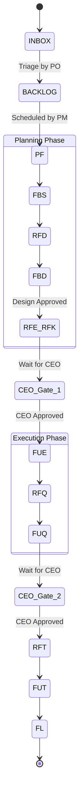

# 🏛️ 가재 컴퍼니 시스템 설계 (Sanctuary Architecture v15.5 - The Complete Archive)

**[문서의 목적]**: 본 문서는 **OpenClaw (AI Agent)**에게 시스템 구축을 지시하기 위한 **최종 기술 명세서(Technical Specification)**입니다.
**[핵심 철학]**: "인간 CEO"와 "11명의 AI 가재 군단"이 **PC 환경**에서 공존하며, **사회자가재(Main Agent)**가 전체 시스템을 오케스트레이션하고, **`gajae-os` (Engine)**는 순수 로직 판단만 담당합니다.

---

## 1. 런타임 아키텍처 (Runtime Architecture)

**[물리적 환경]**: Mac (PC) + Telegram Bridge + Firestore Database.
**[코드베이스]**: `gajae-os` (TypeScript + LangGraph.js) -> **Decision Engine**

```mermaid
graph TD
    User["👤 CEO (Telegram)"] -->|Message| Bridge["🌉 Telegram Bot API"]
    Bridge -->|Webhook| Main["🖥️ 사회자가재 (Main Agent)"]
    
    subgraph "Local Workspace"
        CLI["⚙️ gajae-os (Logic Engine)"]
        DB[("🔥 Firestore (Memory & Artifacts)")]
    end
    
    subgraph "Sanctuary Squad (10 Experts)"
        PM["👔 Manager"]
        PO["💡 PO"]
        DEV["💻 Dev"]
        UX["🎨 UX"]
        QA["🧪 QA"]
        BA["📊 BA"]
        HR["🧑‍🤝‍🧑 HR"]
        MKT["📢 MKT"]
        LEGAL["⚖️ Legal"]
        CS["📞 CS"]
    end

    subgraph "Presentation Layer"
        Web["📊 Web Dashboard (Next.js)"]
    end

    Main -- "1. Exec CLI" --> CLI
    CLI -- "2. ASK_LLM" --> Main
    Main -- "3. LLM Answer" --> CLI
    CLI -- "4. SPAWN_AGENT" --> Main
    Main -- "5. Spawn" --> PM
    Main -- "5. Spawn" --> PO
    Main -- "5. Spawn" --> DEV
    
    %% All agents write to DB
    Main -.->|"[CEO_COMMAND]"| DB
    PM -.->|"[MODERATION]"| DB
    PO -.->|"[PLAN CONTENT]"| DB
    DEV -.->|"[CODE CONTENT]"| DB
    UX -.->|"[DESIGN CONTENT]"| DB

    %% Web View
    DB -.->|"Realtime Stream (onSnapshot)"| Web
```



### 1.1 성역의 수호자들 (The Gajae Legion - Total 11 Agents)
**[Concept]**: **사회자가재(Main)**를 중심으로 **10명의 전문 스쿼드**가 협업하여 총 11명의 가재 군단을 이룹니다.

| 구분 | 코드 ID (`agentId`) | 한글 애칭 | 역할 (Role) | 비고 |
| :--- | :--- | :--- | :--- | :--- |
| **Host** | `main` | **사회자가재** | 시스템 호스트 | CEO 명령 수신, CLI 실행, LLM 판단 대행, Spawn 실행 |
| **Squad** | `pm` | **매니저가재** | 공정 관리 | 스케줄링, 토론 주재 로직 (Main이 대행) |
| **Squad** | `po` | **기획가재** | 기획 | 기획서 작성 (Spawn 대상) |
| **Squad** | `dev` | **개발가재** | 개발 | 코드 구현 (Spawn 대상) |
| **Squad** | `qa` | **품질가재** | 품질 | 테스트 (Spawn 대상) |
| **Squad** | `ba` | **분석가재** | 분석 | 요구사항 분석 (Spawn 대상) |
| **Squad** | `ux` | **디자인가재** | 디자인 | 디자인 가이드 (Spawn 대상) |
| **Squad** | `hr` | **인사가재** | 인사 | 리소스 관리 (Spawn 대상) |
| **Squad** | `mkt` | **마케팅가재** | 마케팅 | 카피라이팅 (Spawn 대상) |
| **Squad** | `legal` | **변호사가재** | 법무 | 라이선스 검토 (Spawn 대상) |
| **Squad** | `cs` | **민원가재** | 고객지원 | 응대 매뉴얼 (Spawn 대상) |

---

## 2. 데이터 모델 (Data Model Hierarchy)

### 2.1 UML Class Diagram (Logic View)

```mermaid
classDiagram
    %% Core Entities
    class Project {
        +String id
        +String name
        +List current_epic_ids
    }

    class Epic {
        +String id (uuid)
        +String project_id
        +String title
        +EpicStatus status
        +Priority priority
        +String thread_id (LangGraph)
        +Map context_snapshot
    }

    class Task {
        +String id (uuid)
        +String epic_id (Optional)
        +String project_id
        +String title
        +TaskStatus status
        +String assignee_id
    }

    class Artifact {
        +String id
        +String epic_id
        +String type
        +String content (Markdown)
        +DateTime created_at
    }

    class RoleReport {
        +String role_id
        +String summary
        +String status
        +List logs
    }

    class ChronicleEntry {
        +String id
        +String run_id
        +DateTime timestamp
        +String speaker_id
        +DialogueType type
        +String content
        +Map metadata (emotion, intent)
    }

    %% Enums
    class TaskStatus {
        <<enumeration>>
        INBOX
        BACKLOG
        PF, FBS, RFD, FBD, RFE_RFK
        FUE, RFQ, FUQ, RFT, FUT
        FL, FNL
    }

    class Priority {
        <<enumeration>>
        URGENT (Interrupt)
        HIGH
        NORMAL
        LOW
    }

    class DialogueType {
        <<enumeration>>
        CEO_COMMAND
        AGENT_DISCUSSION (🗣️)
        AGENT_RESPONSE (💬)
        INTENT (❗️)
        EMOTION (❤️)
        MODERATION (⚖️)
    }

    Project "1" *-- "many" Epic : Contains
    Epic "1" *-- "many" Task : Contains (Optional)
    Epic "1" *-- "many" Artifact : Contains
    Task "1" *-- "many" RoleReport : Contains
```



### 2.2 Firestore Schema Definition

#### A. `/projects/{projectId}`
*   `name`: 프로젝트명
*   `current_epics`: 진행 중인 Epic ID 목록

#### B. `/epics/{epicId}`
*   `project_id`: 소속 프로젝트 ID
*   `title`: 에픽 명칭
*   `status`: 상태 (PLANNING, IN_PROGRESS, DONE, PAUSED)
*   `priority`: 우선순위 (**URGENT**, HIGH, NORMAL, LOW)
*   `thread_id`: LangGraph 상태 저장용 ID
*   `context_snapshot`: 장기 보존용 상태 스냅샷 (Resync 용)

#### C. `/tasks/{taskId}` (Work Queue Item)
*   `epic_id`: 소속 에픽 ID (**Optional** - 없으면 백로그)
*   `project_id`: 소속 프로젝트 ID
*   `title`: 작업명
*   `instruction`: 구체적 작업 지시
*   `status`: **INBOX**, **BACKLOG**, **PF**, ... (13공정)
*   `assignee`: 담당 가재 ID (`dev`, `po`...)

#### D. `/epics/{epicId}/artifacts/{artifactId}` (New)
*   `type`: 산출물 타입 (1pager, api_spec...)
*   **`content`**: **산출물 내용 전문 (Markdown Text)**
*   `created_at`: 생성 일시

#### E. `/chronicles/{runId}/entries/{entryId}` (Logs)
*   `speaker_id`: 발화자 (main, pm, dev...)
*   `type`: `AGENT_DISCUSSION`(🗣️), `AGENT_RESPONSE`(💬), `INTENT`(❗️), `EMOTION`(❤️), `MODERATION`(⚖️)
*   `content`: 마크다운 내용
*   `metadata`: 상세 정보 (숨김 처리 가능)

---

## 3. 핵심 메커니즘 (Core Mechanisms)

### 3.1 사회자가재 & 매니저가재 프로토콜 (The Executive Loop)
1.  **발화:** CEO "이거 하자" -> `main`이 수신.
2.  **분류 (Triage):** 기획가재(PO)가 `INBOX`를 주기적으로 검토하여 `Project/Epic` 분류.
3.  **계획 (Scheduling):** 매니저가재(PM)가 분류된 Task의 우선순위를 보고 `BACKLOG` -> `PF(착수)`로 상태 변경.
4.  **긴급 대응:** CEO가 "긴급!" 선언 시, 사회자가재가 즉시 `URGENT Epic` 생성 후 매니저가재 호출 -> 강제 인터럽트 발동.

### 3.2 LLM Delegation Loop (The Brain Sharing Protocol)
*   **Problem:** `gajae-os` (로컬 Node)에서 LLM API를 직접 호출하면 비용 발생.
*   **Solution:** `gajae-os`가 판단이 필요할 때 `ASK_LLM` 액션을 반환.
*   **Execution:** `main` Agent(이미 LLM임)가 이 요청을 보고 생각한 뒤, 답을 가지고 `gajae-os`를 다시 실행.

### 3.3 13단계 공정 & 승인 게이트 (Approval Gate)
모든 작업(Task)은 아래 13단계 공정을 엄격하게 따릅니다. 각 단계 전환 시 **CEO의 승인(`Approval Gate`)**이 필수입니다.



### 3.4 뇌 부활 및 재동기화 (Resync Protocol)
*   **Sleep (동면):** Epic 종료/중단 시 `Summary` 작성 후 컨텍스트 삭제.
*   **Wake Up (1년 뒤):**
    1.  DB에서 `context_snapshot` 로드.
    2.  DB의 `artifacts` 내용 로드.
    3.  변경된 환경에 맞춰 상태(State) 보정 후 재개.

### 3.5 아티팩트 관리 (All-in-DB Strategy)
*   **저장소:** 모든 산출물(기획서, 디자인 가이드 등)은 **Firestore `artifacts` 컬렉션**에 텍스트 형태로 저장한다.
*   **Git:** 오직 `gajae-os` 시스템 코드와 `SYSTEM_DESIGN` 문서만 저장한다. (데이터와 코드의 완전한 분리)

---

## 4. 구현 가이드 (Implementation Guide)

### 4.1 디렉토리 구조 (Canonical Directory)
```
yuna-openclaw/
├── docs/
│   └── core/               # 시스템 핵심 문서 (System Design, Culture)
└── gajae-os/               # 시스템 코드 (TS - Orchestrator)
    ├── src/
    │   ├── agents/         # 에이전트 로직
    │   ├── core/           # Firebase, OpenClawClient
    │   ├── graph/          # LangGraph Workflow
    │   └── types/          # TS Interfaces
    ├── .env                # (루트 참조)
    └── cli.ts              # CLI Entry Point
```

### 4.2 기술 스택
*   **Language:** TypeScript (Node.js)
*   **Orchestration:** LangGraph.js
*   **Storage:** Firestore (Data/Queue/Artifacts)
*   **Brain:** Main Agent (OpenClaw) Delegation

---

**[결론]**: 이 설계도는 **사회자가재(Main/Brain)**와 **가재 OS(Body)**가 결합된 완전 자율형 조직 시스템이며, 모든 데이터는 **Firestore에 중앙 집중화**되어 관리됩니다. 🦞🚀