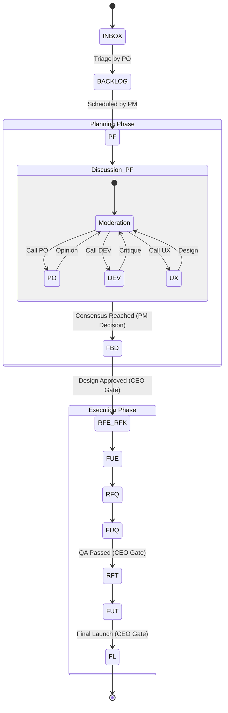

# 🏛️ 가재 컴퍼니 시스템 설계 (Sanctuary Architecture v14.1 - The Complete Archive)

**[문서의 목적]**: 본 문서는 **OpenClaw (AI Agent)**에게 시스템 구축을 지시하기 위한 **최종 기술 명세서(Technical Specification)**입니다.
**[핵심 철학]**: "인간 CEO"와 "11명의 AI 가재 군단"이 **PC 환경**에서 공존하며, **비서가재(Biseo Gajae)**가 지능적 게이트키퍼로서 중재하고, 그 모든 과정은 **크로니클(Chronicle)**로 투명하게 기록됩니다.

---

## 1. 런타임 아키텍처 (Runtime Architecture)

**[물리적 환경]**: Mac (PC) + Telegram Bridge + Firestore Database.
**[코드베이스]**: `gajae-os` (TypeScript + LangGraph.js) -> **Orchestration Engine**

```mermaid
graph TD
    User["👤 CEO (Telegram)"] -->|Message| Bridge["🌉 Telegram Bot API"]
    Bridge -->|Webhook| Main["🖥️ 비서가재 (Main Agent)"]
    
    subgraph "Local Workspace"
        OS["⚙️ gajae-os (CLI)"]
        DB[("🔥 Firestore (Memory)")]
    end
    
    subgraph "Star Topology (Centralized)"
        PM["👔 Manager (Moderator)"]
        PO["💡 PO"]
        DEV["💻 Dev"]
        UX["🎨 UX"]
        QA["🧪 QA"]
        ETC["..."]
    end

    Main -->|Exec CLI| OS
    OS -->|Read/Write| DB
    OS -- "Return Action" --> Main
    
    Main -- "Spawn" --> PM
    PM -- "Call (Turn)" --> PO
    PM -- "Call (Turn)" --> DEV
    PM -- "Call (Turn)" --> UX
    
    %% All agents write to DB
    Main -.->|"[CEO_COMMAND]"| DB
    PM -.->|"[MODERATION] / [DECISION]"| DB
    PO -.->|"[OPINION]"| DB
    DEV -.->|"[CRITIQUE]"| DB
    UX -.->|"[DESIGN]"| DB
```



### 1.1 성역의 수호자들 (Sanctuary Squad - 11 Micro-Agents)
**[Concept]**: 12명의 가재는 **OpenClaw 상의 독립된 Agent ID**를 가집니다. `gajae-os`는 이들을 직접 실행하는 게 아니라, **`Action Plan`을 반환하여 Main Agent가 실행하게** 합니다.

| 코드 ID (`agentId`) | 한글 애칭 | 역할 (Role) | 비고 |
| :--- | :--- | :--- | :--- |
| `main` (biseo) | **비서가재** | 문지기 (Gatekeeper) | CEO 명령 수신, `gajae-os` 구동 |
| `pm` | **매니저가재** | 공정 관리 (Manager) | **능동적 사회자(Active Moderator)** |
| `po` | **기획가재** | 기획 (Product Owner) | 기획서 작성, 토론 발제 |
| `ba` | **분석가재** | 분석 (Business Analyst) | 요구사항 분석 |
| `ux` | **디자인가재** | 디자인 (UX/UI Designer) | 디자인 가이드 작성 |
| `dev` | **개발가재** | 개발 (Developer) | 코드 구현, 기술 검토 |
| `qa` | **품질가재** | 품질 (Quality Assurance) | 테스트 수행 |
| `hr` | **인사가재** | 인사 (HR Manager) | 리소스 관리 |
| `mkt` | **마케팅가재** | 마케팅 (Marketer) | 카피라이팅 |
| `legal` | **변호사가재** | 법무 (Legal Advisor) | 라이선스 검토 |
| `cs` | **민원가재** | 고객지원 (CS Specialist) | 응대 매뉴얼 작성 |

---

## 2. 데이터 모델 (Data Model Hierarchy)

### 2.1 UML Class Diagram (Logic View)

```mermaid
classDiagram
    %% Core Entities
    class Project {
        +String id
        +String name
        +List current_epic_ids
    }

    class Epic {
        +String id (uuid)
        +String project_id
        +String title
        +EpicStatus status
        +Priority priority
        +String thread_id (LangGraph)
        +Map context_snapshot
    }

    class Task {
        +String id (uuid)
        +String epic_id (Optional)
        +String project_id
        +String title
        +TaskStatus status
        +String assignee_id
    }

    class RoleReport {
        +String role_id
        +String summary
        +String status
        +List logs
    }

    class ChronicleEntry {
        +String id
        +String run_id
        +DateTime timestamp
        +String speaker_id
        +DialogueType type
        +String content
        +Map metadata (emotion, intent)
    }

    %% Enums
    class TaskStatus {
        <<enumeration>>
        INBOX
        BACKLOG
        PF, FBS, RFD, FBD, RFE_RFK
        FUE, RFQ, FUQ, RFT, FUT
        FL, FNL
    }

    class Priority {
        <<enumeration>>
        URGENT (Interrupt)
        HIGH
        NORMAL
        LOW
    }

    class DialogueType {
        <<enumeration>>
        CEO_COMMAND
        AGENT_DISCUSSION (🗣️)
        AGENT_RESPONSE (💬)
        INTENT (❗️)
        EMOTION (❤️)
        MODERATION (⚖️)
    }

    Project "1" *-- "many" Epic : Contains
    Epic "1" *-- "many" Task : Contains (Optional)
    Task "1" *-- "many" RoleReport : Contains
```



### 2.2 Firestore Schema Definition

#### A. `/projects/{projectId}`
*   `name`: 프로젝트명
*   `current_epics`: 진행 중인 Epic ID 목록

#### B. `/epics/{epicId}`
*   `project_id`: 소속 프로젝트 ID
*   `title`: 에픽 명칭
*   `status`: 상태 (PLANNING, IN_PROGRESS, DONE, PAUSED)
*   `priority`: 우선순위 (**URGENT**, HIGH, NORMAL, LOW)
*   `thread_id`: LangGraph 상태 저장용 ID
*   `artifacts`: 산출물 링크 목록 (Git 경로 + 웹 URL)
*   `context_snapshot`: 장기 보존용 상태 스냅샷 (Resync 용)

#### C. `/tasks/{taskId}` (Work Queue Item)
*   `epic_id`: 소속 에픽 ID (**Optional** - 없으면 백로그)
*   `project_id`: 소속 프로젝트 ID
*   `title`: 작업명
*   `instruction`: 구체적 작업 지시
*   `status`: **INBOX**, **BACKLOG**, **PF**, ... (13공정)
*   `assignee`: 담당 가재 ID (`dev`, `po`...)

#### D. `/tasks/{taskId}/reports/{roleId}` (Role-Specific Memory)
*   `role_id`: `dev`, `ux` 등
*   `summary`: 해당 역할 관점의 요약 (기술적/디자인적 등)
*   `status`: DONE, IN_PROGRESS
*   `logs`: 해당 역할의 실행 로그 모음

#### E. `/chronicles/{runId}/entries/{entryId}` (Logs)
*   `speaker_id`: 발화자 (biseo, pm, dev...)
*   `type`: `AGENT_DISCUSSION`(🗣️), `AGENT_RESPONSE`(💬), `INTENT`(❗️), `EMOTION`(❤️), `MODERATION`(⚖️)
*   `content`: 마크다운 내용
*   `metadata`: 상세 정보 (숨김 처리 가능)

---

## 3. 핵심 메커니즘 (Core Mechanisms)

### 3.1 비서가재 & 매니저가재 프로토콜 (The Executive Loop)
1.  **발화:** CEO "이거 하자" -> 비서가재가 `INBOX` 상태로 Task 생성.
2.  **분류 (Triage):** 기획가재(PO)가 `INBOX`를 주기적으로 검토하여 `Project/Epic` 분류.
3.  **계획 (Scheduling):** 매니저가재(PM)가 분류된 Task의 우선순위를 보고 `BACKLOG` -> `PF(착수)`로 상태 변경.
4.  **긴급 대응:** CEO가 "긴급!" 선언 시, 비서가재가 즉시 `URGENT Epic` 생성 후 매니저가재 호출 -> 강제 인터럽트 발동.

### 3.2 Action Planner Pattern (Orchestration)
*   **Engine (`gajae-os` CLI):** 상태 머신(LangGraph)을 돌리고 **`AgentAction` (JSON)**을 반환.
*   **Main Agent (`biseo`):** CLI의 출력을 파싱하여 **`openclaw.spawn(agentId)`**를 실제로 실행.
*   **Context Injection:** 깨울 때 해당 에이전트의 `RoleReport` (과거 요약)와 `Current Task Info`를 주입하여 실행.

### 3.3 13단계 공정 & 승인 게이트 (Approval Gate)



### 3.4 능동적 토론 및 합의 프로토콜 (Active Discussion Protocol)
**매니저가재(PM)**는 수동적인 사회자가 아닙니다. 상황을 판단하여 필요한 가재를 **강제 소환(Call-out)**하고, 토론을 **주도(Lead)**합니다.

```mermaid
sequenceDiagram
    participant PM as 매니저가재
    participant PO as 기획가재
    participant DEV as 개발가재
    participant UX as 디자인가재
    participant DB as Firestore (Chronicle)

    PM->>PO: "로그인 기능 기획해" (Task Assign)
    PO->>DB: [Plan] "JWT 토큰 방식 로그인 기획서(Draft)"
    
    loop Discussion Loop (PM Moderation)
        PM->>PM: "기획서가 나왔군. 기술적 검토가 필요해." (Think)
        PM->>DEV: "PO 기획서 기술 검토해. 보안 이슈 없나?" (Proactive Call)
        DEV->>DB: [Critique] "Refresh Token 저장소 문제 있음" (Reject)
        
        PM->>PM: "디자인 관점에서도 봐야겠어." (Think)
        PM->>UX: "UX 검토해. 사용자 흐름 괜찮아?" (Proactive Call)
        UX->>DB: [Critique] "에러 메시지가 너무 딱딱함" (Reject)
        
        PM->>PO: "DEV랑 UX 의견 반영해서 수정해." (Order)
        PO->>DB: [Revise] "지적사항 반영 완료" (Update)
        
        PM->>PM: "더 빠진 거 없나? QA 의견도 들어볼까?" (Active Check)
    end
    
    PM->>PM: "모두 동의했군."
    PM->>DB: [State Transition] PF -> FBD (Consensus Declared)
```



*   **Role Comprehension:** PM은 각 가재의 역할(`SystemRole`)을 이해하고, 적재적소에 질문을 던진다.
*   **Proactive Prompting:** 조용한 가재에게도 의견을 묻는다. ("QA가재, 테스트 관점에서 문제없어?")
*   **Consensus Check:** 모든 쟁점이 해결되었는지 확인 후 `DONE` 선언.

### 3.5 뇌 부활 및 재동기화 (Resync Protocol)
*   **Sleep:** Epic 종료/중단 시 `Summary` 작성 후 컨텍스트 삭제.
*   **Wake Up (1년 뒤):**
    1.  DB에서 `context_snapshot` 로드.
    2.  현재 파일 시스템과 비교(Diff).
    3.  변경된 환경에 맞춰 상태(State) 보정 후 재개.

### 3.6 아티팩트 관리 (Dual Storage)
*   **원본:** Git 저장소 (`docs/epics/...`)에 마크다운으로 저장.
*   **인덱스:** Firestore에 해당 파일의 링크 저장.
*   **보고:** 비서가재가 DB 조회 후 "여기 있습니다" 하고 링크 제공.

---

## 4. 구현 가이드 (Implementation Guide)

### 4.1 디렉토리 구조 (Canonical Directory)
```
docs/
├── epics/                  # 에픽별 산출물 아카이브
│   ├── E001-login/
│   │   ├── 1-plan/ (1pager.md)
│   │   ├── 2-design/ (gui.md)
│   │   └── 3-dev/ (api.md)
├── core/role/              # 가재별 역할 정의 (ROLE_DEV.md)
└── gajae-os/               # 시스템 코드 (TS - Orchestrator)
    ├── src/
    │   ├── agents/         # 에이전트 로직 (PO, PM, DEV...)
    │   ├── core/           # Firebase, OpenClawClient
    │   ├── graph/          # LangGraph Workflow
    │   └── types/          # TS Interfaces
    ├── .env                # (루트 참조)
    └── cli.ts              # CLI Entry Point
```

### 4.2 기술 스택
*   **Language:** TypeScript (Node.js)
*   **Orchestration:** LangGraph.js
*   **Storage:** Firestore (Data/Queue) + Local Git (Docs/Code)
*   **Runtime:** OpenClaw Multi-Agent System (11 Agents)

---

**[결론]**: 이 설계도는 **비서가재(Brain)**와 **가재 OS(Body)**가 결합된 완전 자율형 조직 시스템입니다. 🦞🚀